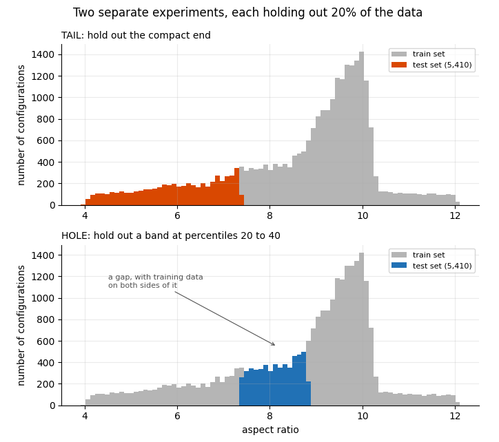
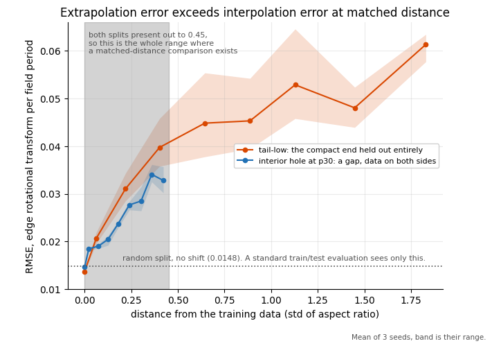
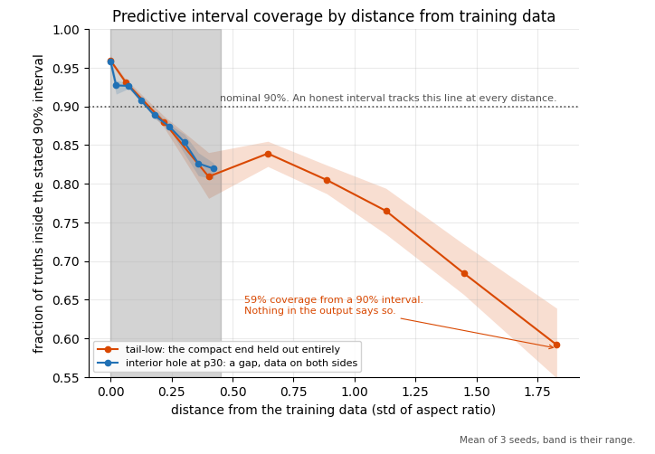
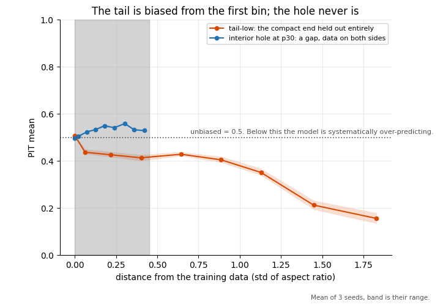
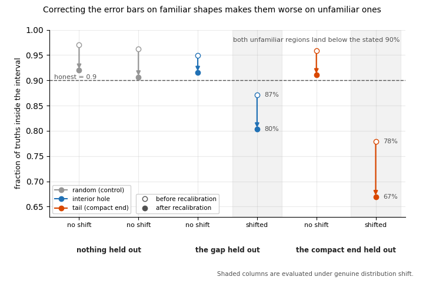
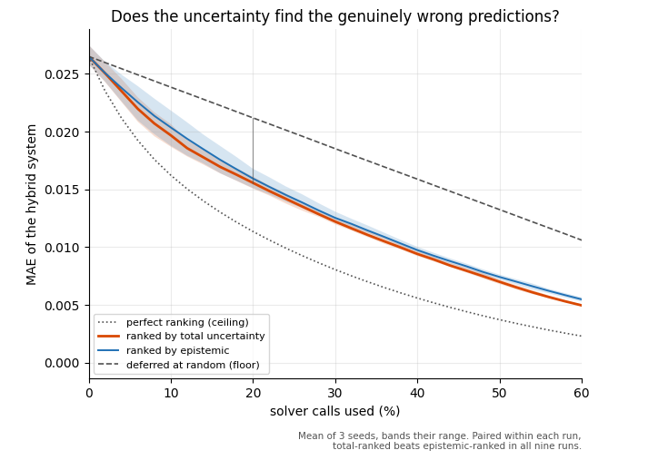
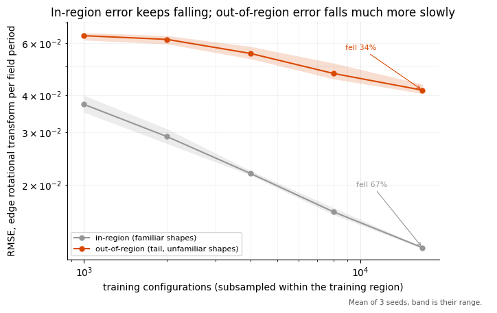

# Where can you trust a stellarator surrogate?

**Short version:** I trained a fast model to replace a slower physics simulation,
then measured where its answers stop being trustworthy. Three findings:

- **The error bars fail where they matter most.** On the least familiar shapes
  the error roughly triples while the stated error bar only doubles, and a
  range the model calls "90%" holds the truth 59% of the time.
  ([Do the error bars keep up?](#do-the-error-bars-keep-up))
- **The standard fix makes it worse.** Recalibrating on the data you have
  narrows intervals that were already too narrow.
  ([Can recalibration fix it?](#can-recalibration-fix-it))
- **The ranking still works.** Sending the 20% of shapes the model is least
  sure about to the simulation cuts the error by 41%, against 20% for a random
  20%. ([What is the uncertainty good for?](#what-is-the-uncertainty-good-for))

The uncertainty is wrong as an absolute number, but still right as an order. 
That is the useful part of this project.

---

## Background

A **stellarator** is a magnetic confinement fusion device. Its confining field is
produced entirely by external coils, twisted into a three-dimensional geometry
that holds the plasma in place without driving a current through it.

The object being designed is the **plasma boundary**, the outer surface the
confined plasma is held to. In this dataset a boundary is parameterised by
**80 Fourier coefficients**. A stellarator's twist repeats a fixed number of
times around the torus, its **field period count**, and everything in this project is at
field period = 3, matching Proxima's own example filter. The coefficients are indexed in 
units of that count, so a boundary built at a different field period count is a different 
kind of object, not a further-away point in the same space.

To find out whether a shape is good, engineers run an equilibrium solver,
VMEC++, and compute performance metrics from the field it produces. That solve
is the expensive step: this dataset alone is the product of roughly 182,000
candidate boundaries evaluated that way.

So people train a **surrogate**: a neural network that looks at the 80 numbers
and predicts one of those metrics directly, here the **edge rotational
transform**, a measure of how much the magnetic field lines twist around the
torus per trip. However, it inherits one catch, true of supervised models
generally:

> A model is accurate on inputs resembling its training data and degrades outside
> it. A point prediction gives no indication of which case you are in, so the
> output looks the same whether the input was well covered or not.

This is the covariate-shift failure mode, and it is silent: nothing in the
prediction itself flags the problem. The standard response is to have the model
report an uncertainty alongside each prediction. **Whether that uncertainty can
be trusted in the region where it matters most (the compact end: low aspect
ratio, a fatter torus relative to its size) is what this project measures.**

The team behind the dataset, Proxima Fusion, published it with a baseline
surrogate of their own ([arXiv 2506.19583](https://arxiv.org/abs/2506.19583),
NeurIPS 2025). In their appendix A.4, they report how accurate it is on familiar
shapes, then note that surrogates like this go wrong when asked about unfamiliar
ones, and list uncertainty calibration as one of the strategies to continue forward.

This project does that.

The compact end matters on its own terms. The paper's Section 3 lists
"limiting the aspect ratio to achieve a compact device" as an engineering and
economic consideration in stellarator design, not merely a gap in prior work
([arXiv 2506.19583](https://arxiv.org/abs/2506.19583), Section 3).
A confidently wrong surrogate does the most damage exactly where
the dataset is thinnest, which is also where the design goal actually
points.

---

## Setup

### Three splits

The hard part is defining "unfamiliar". You cannot just test on random held-out
shapes, because those are all familiar by construction. So I built **three
different train/test splits** and trained the same model on each.



- **Random split.** Ordinary train/test. Every test shape looks like the training
  shapes. This is the **control**.
- **Tail.** Hold back one whole end of the range: the most compact shapes. The
  model has never seen anything like them, and there is no data on the far side.
  Can the model step outside what it knows?
- **Interior hole.** Cut a band out and hold it back, but choose one with
  training data on *both sides* of it. Can the model fill in a gap?

The hole is placed directly next to the tail's band, not in the middle of the
data. Two reasons, and neither is aesthetic. The two bands must not overlap, or
the experiments would share shapes and could not be compared. And a gap in the
dense middle is too easy: the model is never more than a short step from
familiar data, so there is almost nothing to measure. Sitting next to the tail
puts the hole in the thinnest data an interior gap can reach, which is what makes
the comparison against the tail a fair one.

Splitting this way lets me separate two failures that are usually lumped
together. **"Cannot fill in a gap" and "cannot go past the edge" need different
responses.** A gap can be filled by running a few more simulations in that spot.
Going past the edge cannot be fixed that way.

### How the uncertainty is built

The model is an ensemble of 10 networks, each with two outputs, a mean and a
variance head, indexed here as $\mu_k(x)$ and $\sigma_k^2(x)$ for network $k$. This
is the standard deep ensemble ([Lakshminarayanan et al., 2017](#references)):
the architecture and the two-term decomposition are theirs, I add an MSE
warm-up and a variance floor for training stability and omit their adversarial
training step.

- **Ensemble mean**: the average of the 10 predicted means, the number actually
  reported as the prediction.
  $$\bar\mu(x) = \frac{1}{K}\sum_{k=1}^{K} \mu_k(x)$$

- **Epistemic uncertainty**: how much the 10 means disagree with each other.
  Wide agreement means confidence, wide disagreement means the training data
  left room for different networks to learn different things. Shrinks with
  more data.
  $$\sigma^2_{\text{epi}}(x) = \frac{1}{K-1}\sum_{k=1}^{K} \big(\mu_k(x) - \bar\mu(x)\big)^2$$

- **Aleatoric uncertainty**: the average of the 10 networks' own reported
  variances, each network's estimate of the error it expects on top of its
  best guess.
  $$\sigma^2_{\text{ale}}(x) = \frac{1}{K}\sum_{k=1}^{K} \sigma_k^2(x)$$

- **Total uncertainty**: epistemic plus aleatoric, the number reported as the
  model's error bar.
  $$\sigma^2_{\text{total}}(x) = \sigma^2_{\text{epi}}(x) + \sigma^2_{\text{ale}}(x)$$

**Aleatoric is not literally noise here.** As far as it can be measured, this
dataset has none: the few dozen genuinely near-identical shape pairs in it get
simulation results that agree to six decimal places.
What the term actually measures is the **network's own misfit**, the part of the
function it cannot fit exactly, which looks like noise from inside the model.

**The split is validated, not just assumed.** Across a seventeenfold increase
in training data, the epistemic term fell 1.7x and the misfit part of the
aleatoric term fell 3.6x, exactly what two measures of ignorance and misfit
should do as data grows. A separate run adds Gaussian noise of a known size
to the training targets; comparing its aleatoric term against the clean run
above recovers the injected noise at 0.0208, against a true 0.020. That is
evidence the two terms measure what their names claim, ignorance and noise.


### Does the model work at all?

Before claiming anything about uncertainty, the underlying model has to be
credible. A plain MSE ensemble, built to match the published baseline's
objective, lands at about 1.75x their error on the same metric. The
mean-variance model every result below rests on lands at about 2.1x; part of
that gap is the cost of predicting variance, and part of it is that this
model trains on less data, since an in-region validation slice is
carved out first. Both use the same frozen recipe, chosen by a small
hyperparameter search run once, three learning rates by two batch sizes, six
configurations in under ten minutes; theirs is a published reference whose
own tuning process I do not have access to.


Three honest limits on that comparison:

- Applying every filter their published code performs, three field periods
  included, gives me 27,050 rows where they report about 23,000. Two intermediate counts, 158,685 and 68,191, land
  exactly on the paper's own published figures, so my pipeline follows their
  documented steps correctly up to that point. The remaining gap could be an incompletely
  documented filter, or the dataset growing since their submission.
- That same size difference is part of why R-squared isn't comparable either,
  only the raw error is. R-squared depends on how spread out the test set is,
  and ours differs from theirs in both size and distribution.
- Their paper does not say enough about their architecture for me to claim I reproduced
  it. I matched the metric, not the model.

---

## Results

### Does the error grow as shapes get less familiar?

**It does, in both conditions, and at the same distance the tail costs more
than the hole.**

Each held-out shape is scored on how far it sits from the nearest training
shape, measured along the aspect ratio axis. Plotting error against that
distance separates two things a single accuracy number cannot: whether the
model degrades at all, and whether it degrades differently at a gap than at
the edge of the data.



Both conditions get worse with distance, and the tail sits above the hole
almost everywhere.

**Most of that difference is distance, not the edge.** The tail's held-out set
reaches much further out, to 2.1 standard deviations against the hole's 0.45,
and two thirds of its shapes sit beyond anything the hole contains. So
comparing the two aggregates partly compares distance rather than the thing
the split was built to isolate. The grey band marks the range where both
splits have shapes, which is the only place a fair comparison exists. Inside
it, at the same distance, the tail costs more than the hole in every one of
three training runs, by 12% to 23%.

### Do the error bars keep up?

**They do not. On the least familiar shapes the error roughly triples while the
stated error bar only doubles**, so the model notices it is on shakier ground,
just not by enough.

Growing error is fine if the reported range grows with it. This plots the
fraction of truths that actually landed inside the model's stated 90% interval,
against the same distance axis.



The dotted line is where an honest 90% interval would sit. In region the model
is slightly cautious, covering about 95%. Both curves fall below it early and
keep going: the hole reaches 81% at the edge of its range, 0.45 standard
deviations out, and the tail falls to 59% at the furthest distance measured,
where a stated "90%" interval is really a 60% one. Nothing in the output says
so.

Over the shared range the two curves sit close together, so interval width fails much the same way whether the model is filling a
gap or leaving the data. The random control shows neither problem, which is
what makes those readings believable. What separates the hole from the tail is
a bias neither curve can show, the next result.


### Is the tail biased, or just imprecise?

**Biased. The hole is not.**

A wide error bar and a systematically wrong prediction are different failures,
and coverage alone cannot tell them apart. A diagnostic called PIT (the
probability integral transform) can. For each point, it marks where the truth
landed inside the model's predicted distribution, expressed as one number
between 0 and 1. An unbiased model's PIT values average 0.5. A value
consistently below 0.5 means the truth keeps landing in the lower half of what
the model predicted, which happens when the model's central guess is itself
shifted too high, not merely too confident.



The interior hole sits flat at 0.50 to 0.56 across its entire range, no trend
and little bias. The tail is biased from the first bin, already at 0.43, and falls
to 0.15 at the furthest distance measured. Widening the error bars would not
fix this: it is the center of the prediction that is wrong, and that is a
different problem from the interval being too narrow.

### Can recalibration fix it?

**No. It helps where it is fitted and makes both shifted cases worse.**

If the error bars are miscalibrated, the standard repair is variance scaling
([Kuleshov et al., 2018](#references)): measure how far off the ranges are on
data you already have, then stretch or shrink every future range by that same
factor. On familiar shapes the model was a little too cautious, so the fix
correctly narrowed its ranges there.



Each arrow runs from before the correction, the open circle, to after it, and
the dashed line is where an honest 90% interval would sit. Every arrow points
down, because one scalar shrinks every interval it touches.

The result has three parts. It works where it was fitted, the familiar columns
land on the line. It transfers harmlessly on the random split, which has no
real shift to correct for. And it backfires on both genuinely shifted cases:
the interior hole drops from 87% to 80% and the tail from 78% to 67%, because
one scalar cannot fix a model that is too cautious near home and too confident
far away.

For the tail there is a second reason no scalar could have worked. Variance
scaling only stretches or shrinks the width of the range; it cannot shift where
the range is centered. The PIT result above showed the tail's center is what is
wrong, so the fix narrowed a width that was not the problem and left the bias
untouched.

There is no cheap post-processing trick that fixes the intervals here.


### What is the uncertainty good for?

**Ranking.** It orders predictions well enough that solving the most uncertain
20% of shapes cuts the total error by 41%, twice what solving a random 20%
achieves, even though the ranges behind it cannot be read literally.

On unfamiliar shapes the stated ranges still carry real information about the
*order*: the predictions the model flags as least certain tend to be the worst
ones more often than chance would explain. So use it as a filter. Send the
most uncertain 20% of shapes to the simulation and keep the fast model's
answer for the other 80%.

| approach | error reduction |
|---|---|
| check the 20% the model flags | **41%** |
| check a random 20% | 20% |

Put another way: checking designs at random, you would need to send half of
them, 50 out of 100, to cut the error in half, that is just what "no signal"
looks like. With the model's ranking, checking the worst 27 out of 100 gets you
there instead.

The figure below turns that single 20%-deferral example into a full curve
into a full curve. The horizontal axis is the percentage of shapes sent to the
solver, and the vertical axis is the error that remains after doing so. Pick a
solver-call budget you can afford, find it on the curve, and read off the error
left over.



**The two grey lines are the reference points that make the model's curve
readable.**

- **Deferred at random**, the dashed line, is the same budget spent blindly:
  send 20% random shapes to the solver and remove about 20% of the error.
- **Perfect ranking**, the dotted line, is the best any ordering could possibly
  do. It assumes you already knew which predictions were wrong and sent exactly
  those to the solver. Nobody can have that, which is why it is a ceiling rather than a
  target.

The model's curve sits roughly two thirds of the way from the blind line to the
perfect one, the honest summary of how much the uncertainty signal is worth:
clearly far better than nothing, and clearly not clairvoyant.

Together with the two results before it, this is the whole finding. The ranges
understate the real error, the standard fix cannot repair that
off-distribution, and the ranking still works. Reporting only the ranking
would hide that the ranges cannot be read literally. Reporting only the
miscalibration would make the model sound less useful than it is. Both are
true at once: wrong as a number, still right as an order.

### Does more data close the gap?

**More data helps everywhere, but far more where the model is already
reliable, so it cannot be trusted to close the gap between familiar and
unfamiliar performance, and by the measure that matters most, that gap
actually widens.**

Across five training-set sizes, from 1,000 shapes up to about 17,000, the
error on familiar shapes fell by 67%. The error on unfamiliar shapes fell
too, but only by 34%, so the model's penalty for being unfamiliar with a
shape grew from 1.7x to 3.4x over the same sweep.



The grey line is error on familiar (in-region) shapes, the orange line is
error on unfamiliar (out-of-region) shapes. Both fall as the training set
grows, but the grey line falls much faster, so the ratio between them widens
rather than closing.

Put more carefully, none of the extra data came from the region being
tested, all of it came from the region the model already knew. Even so,
some of that benefit carried over, just far less than what the same data
buys inside the region, which is why the gap keeps growing instead of
closing.

Scaling the dataset is not a fix for this gap. Sampling deliberately in the
sparse region, or using deferral to catch the cases the model can't be
trusted on, are what would actually help.

---

## Limitations

- **The model never saw failures.** About 24,000 shapes failed somewhere in the
  pipeline, at the solver or earlier at boundary generation, and were excluded,
  so it only ever learned from shapes that worked.
- **The data was not designed as an experiment.** It is wherever the original
  optimizers happened to converge. That imbalance is what makes this study
  possible and is also a limit on it.
- **One device family and one dataset.** Three field periods throughout, so
  nothing here says how the model behaves at a different count.
- **One target metric.** All uncertainty results are for one physics quantity. A
  second one also degrades at the compact end, so the basic premise is not
  specific to my choice, but the size and direction of the effect are.
- **Shapes only, no coils.** Whether a shape could actually be built is a separate
  question this does not touch.
- **Deferral assumes the simulation answers, and sometimes it does not.** In the
  region deferral sends work to, about a third of solves fail, against 12%
  elsewhere, which turns the 41% improvement into roughly 28%. The cause is not
  compactness: every recorded failure comes from one shape-generating pipeline,
  which supplies 82% of that region against 34% of everywhere else, and inside
  that pipeline compact shapes fail only 1.1x as often as the rest. Solver
  reliability is a property of the proposal process, not of the geometry, which
  is the more useful finding, since it says what to change.


---

## What I would do next

1. **Active learning.** Use the uncertainty to choose which shapes to simulate
   next, and see whether it beats choosing at random. Cut here for compute cost,
   not for lack of interest.
2. **A second target metric**, to test whether "where the model can be trusted" is
   a property of the design space or of the specific quantity being predicted.
3. **Other uncertainty methods**, Gaussian processes and Laplace approximations,
   deliberately excluded so this result stands on the simpler method alone.
4. **A corrected deferral curve** that accounts for simulations failing, instead of
   reporting that as a caveat.

---

## References

- Proxima Fusion, *ConStellaration: A dataset of QI-like stellarator plasma
  boundaries and optimization benchmarks*, [arXiv
  2506.19583](https://arxiv.org/abs/2506.19583), NeurIPS 2025.
- Lakshminarayanan et al., *Simple and scalable predictive uncertainty estimation
  using deep ensembles*, NeurIPS 2017.
- Kuleshov et al., *Accurate uncertainties for deep learning using calibrated
  regression*, ICML 2018.

---

## What is in this repository

```
src/constellaration_uq/   the reusable pieces: data loading, splits, model, metrics
scripts/                  one script per experiment, each writing to results/
results/                  all committed data files, so you can check any number
figures/                  all committed figures, PNG and PDF
notebooks/figures.ipynb   every figure and table, with the reasoning beside it
tests/                    automated tests for the parts that do real logic
```

One document carries the thinking rather than the code:

- **[`constellaration-uq-decisions.md`](constellaration-uq-decisions.md)** is a
  decision log. Every choice, why it was made, and what would change it, including
  the ones I got wrong and corrected.

**All results and figures are committed on purpose**, so nothing has to be run to
check the numbers.

---

## Running it

Use the Python environment that has the package installed, not a bare `python3`.

```bash
python3 -m pip install -r requirements.txt
python3 -m pip install -e .

python3 scripts/mv_ensemble.py random
python3 scripts/mv_ensemble.py hole
python3 scripts/mv_ensemble.py tail

python3 scripts/calibration.py
python3 scripts/deferral.py
python3 scripts/recalibration.py
```

Each of the three models takes about 8 minutes on a CPU. Everything after
that reads their saved output and finishes in seconds.

Runs are deterministic, so rerunning with the same seed reproduces the committed
files exactly. That is the regression check: if a saved file changes after a
cleanup that was supposed to change nothing, then it changed something.

The raw dataset is 585 MB and not stored in git:

```python
from huggingface_hub import snapshot_download
snapshot_download(
    repo_id='proxima-fusion/constellaration',
    repo_type='dataset',
    allow_patterns=['data/*'],
    local_dir='data_raw',
)
```
